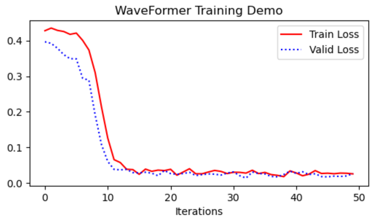

# WaveFormer: transformer-based denoising method for gravitational-wave data
[](https://img.shields.io/badge/release-v1.0.0-orange.svg)
[](https://shields.io/badge/license-Apachev2.0-green.svg)

## Introduction

This repository contains the code and data example of our paper. 
Data parallel and model parallel machanism are choosable during running the code.
Based on [Megatron-LM framework](https://github.com/NVIDIA/Megatron-LM), we achieved gravitational wave denoising and significance estimation with transformer-based model.

- To access our pre-release paper: [ArXiv](https://arxiv.org/abs/2212.14283)
- To access our published paper: [MLST](https://iopscience.iop.org/article/10.1088/2632-2153/ad2f54)

## Abstract
With the advent of gravitational-wave astronomy and the discovery of more compact binary coalescences, data quality improvement techniques are desired to handle the complex and overwhelming noise in gravitational wave (GW) observational data.
Though recent machine learning-based studies have shown promising results for data denoising, they are unable to precisely recover both the GW signal amplitude and phase.
To address such an issue, we develop a deep neural network centered workflow, WaveFormer, for significant noise suppression and signal recovery on observational data from the Laser Interferometer Gravitational-Wave Observatory (LIGO).
The WaveFormer has a science-driven architecture design with hierarchical feature extraction across a broad frequency spectrum.
As a result, the overall noise and glitch are decreased by more than one order of magnitude and the signal recovery error is roughly 1\% and 7\% for the phase and amplitude, respectively.
Moreover, on 75 reported binary black hole (BBH) events of LIGO we obtain a significant improvement of inverse false alarm rate.
Our work highlights the potential of large neural networks in gravitational wave data analysis and, while primarily demonstrated on LIGO data, its adaptable design indicates promise for broader application within the International Gravitational-Wave Observatories Network (IGWN) in future observational runs.

<div align="center">
    
</div>

## Results
Based on pretrained WaveFormer, we can achieve significant noise suppression on real observational gravitational waveforms.
Here, we present some results on reported binary black hole events.
It can be observed that both phase and amplitude information of the waveforms are well recovered.

<div align="center">
    
</div>

## Requirements

* `python >= 3.8`
* `pytorch >= 1.8.0`
* `astropy == 4.3.1`
* `lalsimulation >= 3.0.0`
* `bilby >= 1.1.4`

## Run Training Demo

Download the whole repository and adapt the arguments in the script, then run:
```shell
bash demo.sh
```
Training curve would be as follows.

<div align="center">
    
</div>

### Arguments
There many different arguments to be adapted in `demo.sh`. If the other arguments are not specified, a default value will be assumed for them. Here are some of the commonly used arguments:

* `MASTER_ADDR`: IP address of your machine.
* `GPUS_PER_NODE`: Number of GPUs per machine used for training.
* `DATA_PATH`: Path to the training dataset (base folder).
* `CHECKPOINT_PATH`: Path to the checkpoint saving folder.
* `num-layers`: Number of encoder layers.
* `num-attention-heads`: Number of attention heads.
* `hidden-size`: Hidden size of each encoder layer.
* `micro-batch-size`: Batch size of each GPU.
* `lr`: Initial learning rate. Depending on decay style.
* `segment-length`: Number of samples in each token.
* `train-iters`: Maximum training iterations.


### More about Training
To train with your own data, you can define corresponding dataset class with reference to `class GwDataset` of [megatron/data/gw_dataset.py](megatron/data/gw_dataset.py)

### Python Environment
We have tested WaveFormer with python 3.8, pytorch 1.10.0, cuda 11.1, and nccl 2.8.3.

To use this repository, we recommend using one of NGC's PyTorch containers (`docker pull nvcr.io/nvidia/pytorch:20.12-py3`).

Optionally, we have build a docker image based on the above container that can be pulled through `docker pull zzhopezhou/astropre:1.5`.
Widely used libraries for gravitaional wave and astronomical analysis including `astropy`, `bilby`, `lalsimulation`, et. al. are already installed in the image.

## Citations
Please cite the following papers if you find the code useful:

```
@article{ren2022intelligent,
  title={Intelligent noise suppression for gravitational wave observational data},
  author={Ren, Zhixiang and Wang, He and Zhou, Yue and Guo, Zong-Kuan and Cao, Zhoujian},
  journal={arXiv preprint arXiv:2212.14283},
  year={2022}
}

@inproceedings{narayanan2021efficient,
  title={Efficient large-scale language model training on gpu clusters using megatron-lm},
  author={Narayanan, Deepak and Shoeybi, Mohammad and Casper, Jared and LeGresley, Patrick and Patwary, Mostofa and Korthikanti, Vijay and Vainbrand, Dmitri and Kashinkunti, Prethvi and Bernauer, Julie and Catanzaro, Bryan and others},
  booktitle={Proceedings of the International Conference for High Performance Computing, Networking, Storage and Analysis},
  pages={1--15},
  year={2021}
}
```
